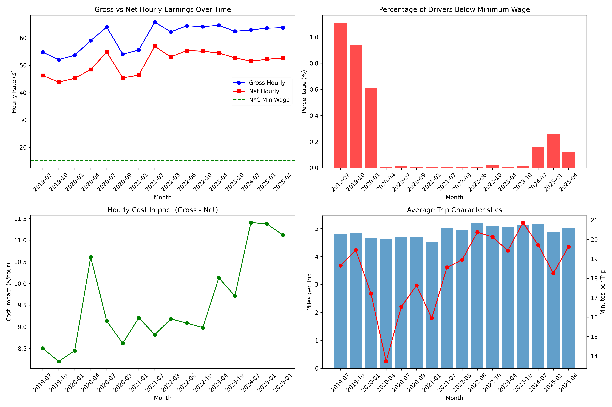

# Gig Economy Hidden Costs Analysis

**Uncovering the Real Economics of Rideshare Driving Through Big Data Analysis**

## Project Overview

This project analyzes the **hidden costs** of gig economy work, specifically focusing on rideshare drivers in NYC. While platforms advertise "$30/hour" earnings, this study reveals the gap between gross earnings and actual take-home pay after accounting for vehicle costs, fuel, insurance, and depreciation.

**Key Research Question:** *How much do rideshare drivers actually earn after all expenses?*

## Key Findings

### The Earnings Reality Gap
- **Platform Claims:** ~$30/hour gross earnings
- **NYC Data Analysis:** $60.67/hour gross → **$51.09/hour net** (after costs)
- **Driver Self-Reports:** $25.30/hour average (Reddit community data)
- **Cost Impact:** Vehicle expenses reduce earnings by **15.8%** on average

### Critical Statistics
- **NYC Market:** Only 0.3% of drivers earn below minimum wage (premium market)
- **National Reality:** 21.6% of drivers report earnings below $15/hour
- **Hidden Costs:** $9.58/hour average in vehicle-related expenses
- **Market Variation:** 2.4x difference between NYC calculated and nationwide reported earnings

## Data Sources

### 1. NYC Taxi & Limousine Commission (Primary Dataset)
- **Size:** 1.1+ billion trip records (2019-2025)
- **Coverage:** 16 strategically selected months
- **Data Points:** Driver pay, trip distance, duration, tips
- **Source:** [NYC TLC Trip Record Data](https://www.nyc.gov/site/tlc/about/tlc-trip-record-data.page)

### 2. AAA Vehicle Operating Costs
- **Methodology:** Industry-standard cost-per-mile calculations
- **Components:** Fuel, maintenance, depreciation, insurance, financing
- **2023 Rate:** $0.729 per mile (adjusted for rideshare usage)
- **Source:** [AAA Your Driving Costs Reports](https://newsroom.aaa.com/auto/your-driving-costs/)

### 3. Reddit Community Analysis
- **Sample:** 93 posts from driver communities
- **Subreddits:** r/uberdrivers, r/lyftdrivers, r/doordash_drivers
- **Extraction:** Automated pattern recognition for earnings data
- **Purpose:** Validation and real-world perspective

## Technical Stack

```python
# Core Technologies
- Python 3.8+
- Pandas & NumPy (Data processing)
- PyArrow (Parquet file handling)
- Matplotlib & Seaborn (Visualization)
- PRAW (Reddit API)
- SQLite (Data storage)
```

### Data Processing Pipeline
1. **Extraction:** Parquet files (15-20M trips/month)
2. **Transformation:** Cost calculations, outlier removal
3. **Loading:** Aggregated monthly summaries
4. **Analysis:** Statistical analysis and trend identification

## Methodology

### Cost Calculation Framework
```python
# Per-trip cost calculation
trip_cost = trip_miles × cost_per_mile_rate
net_earnings = (driver_pay + tips) - trip_cost
hourly_net = net_earnings / (trip_time / 3600)
```

### Data Quality Measures
- **Outlier Filtering:** Removed trips with unrealistic rates (<$5 or >$200/hour)
- **Volume Validation:** Processed 170+ million trips across 16 months
- **Cross-Validation:** Reddit data used to verify calculated trends

## Results Summary

### Monthly Trend Analysis


### Key Insights
1. **Geographic Premium:** NYC represents a high-earning market compared to national averages
2. **COVID Impact:** Clear earnings disruption in 2020, recovery by 2021
3. **Cost Inflation:** Vehicle costs increased significantly 2022-2023
4. **Selection Bias:** Online communities tend to over-represent struggling drivers

### Cost Breakdown (Average per Hour)
- **Gross Earnings:** $60.67
- **Vehicle Costs:** $9.58
- **Net Earnings:** $51.09
- **Above Minimum Wage:** 99.7% of NYC drivers

## Future Development

### Planned AI/ML Enhancements
- **Strategy Optimization:** Reinforcement learning for optimal driving patterns
- **Earnings Predictor:** Time-series forecasting for demand patterns
- **Cost Optimizer:** Real-time expense tracking and route optimization
- **Policy Generator:** LLM-powered recommendations for driver advocacy

### Data Expansion
- Multi-city analysis (Chicago, LA, Miami)
- Temporal granularity (hourly patterns)
- Driver demographic correlation
- Platform comparison (Uber vs Lyft vs delivery apps)

## Project Structure

```
gig-economy-analysis/
├── data-processes/
│   ├── NYC-TLC-analysis/          # Primary analysis pipeline
│   ├── reddit-dataset/            # Community data mining
│   └── AAA-your-driving-costs/    # Vehicle cost references
├── notebooks/                     # Jupyter analysis notebooks
├── src/                          # Core processing scripts
├── results/                      # Output visualizations
└── docs/                         # Documentation
```

## Setup Instructions

### Prerequisites
```bash
# Create virtual environment
python -m venv venv
source venv/bin/activate  # On Windows: venv\Scripts\activate

# Install dependencies
pip install -r requirements.txt
```

### Data Acquisition
1. **NYC TLC Data:** Download from [TLC website](https://www.nyc.gov/site/tlc/about/tlc-trip-record-data.page)


#### NYC TLC Data (16 months, ~15GB total)
1. Visit [NYC TLC Trip Record Data](https://www.nyc.gov/site/tlc/about/tlc-trip-record-data.page)
2. Download the following files to `data-processes/NYC-TLC-analysis/data/raw/`:
   ```
   fhvhv_tripdata_2019-07.parquet
   fhvhv_tripdata_2019-10.parquet
   fhvhv_tripdata_2020-01.parquet
   fhvhv_tripdata_2020-04.parquet
   fhvhv_tripdata_2020-07.parquet
   fhvhv_tripdata_2020-09.parquet
   fhvhv_tripdata_2021-01.parquet
   fhvhv_tripdata_2021-07.parquet
   fhvhv_tripdata_2022-03.parquet
   fhvhv_tripdata_2022-06.parquet
   fhvhv_tripdata_2022-10.parquet
   fhvhv_tripdata_2023-04.parquet
   fhvhv_tripdata_2023-10.parquet
   fhvhv_tripdata_2024-07.parquet
   fhvhv_tripdata_2025-01.parquet
   fhvhv_tripdata_2025-04.parquet
   ```
3. **Reddit API:** Set up credentials at [Reddit Apps](https://www.reddit.com/prefs/apps)
4. **AAA Costs:** Reference data included in `data-processes/AAA-your-driving-costs/`

### Running the Analysis
```bash
# Process NYC TLC data
python src/nyc_tlc_analyzer.py

# Mine Reddit data
python src/reddit_earnings_miner.py

# Generate comparison
python src/analyze_reddit_vs_nyc.py
```

## Impact & Applications

### Academic Research
- Labor economics studies
- Technology and society research
- Platform economy analysis

### Policy Implications
- Minimum wage legislation for gig workers
- Platform transparency requirements
- Worker classification debates

### Industry Applications
- Driver advocacy organizations
- Insurance product development
- Financial services for gig workers

## Contributing

This project is open for collaboration. Areas of interest:
- Data scientist/analysts for methodology improvement
- Labor economists for theoretical framework
- Policy researchers for regulatory applications
- ML engineers for predictive modeling

## License

This project is licensed under the MIT License - see the [LICENSE](LICENSE) file for details.

## Disclaimer

This analysis is for research and educational purposes. Earnings data reflects specific time periods and geographic areas. Individual results may vary significantly based on location, driving patterns, vehicle type, and market conditions.

## Contact

For questions, collaboration, or data requests:
- GitHub: [@IamIlker0](https://github.com/IamIlker0)
- Email: ilkeer0358@gmail.com
- LinkedIn: [Ilker Aydin Yilmaz](https://www.linkedin.com/in/ilker-ayd%C4%B1n-y%C4%B1lmaz-21ba2926b/)

---

**"Revealing the hidden economics of the gig economy, one data point at a time."**